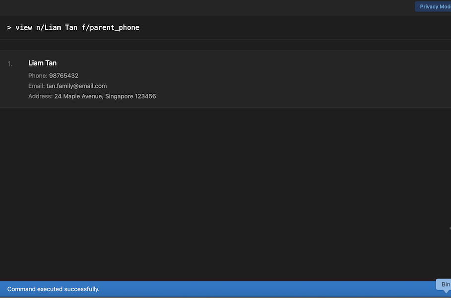

* **TeacherBook CLI** is an app that helps teachers manage student and parent contact information efficiently, through a simple command-line interface. 
  Example usages:
  * Rapidly store, search, and update contact information
  * More features coming soon
* The project currently focuses on a minimal viable product (MVP). Additional features and refinements will be introduced in future iterations.
* For the detailed documentation of this project, see the **[TeacherBook CLI Website](https://ay2526s2-cs2103-f09-3.github.io/tp/)**.
